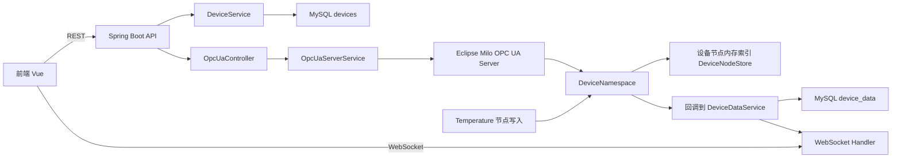

# OPC UA 当前架构总览

## 1. 结论摘要

当前项目的 OPC UA 后端不是独立网关服务，而是：

`Spring Boot 单体应用 + 内嵌 Eclipse Milo OPC UA Server + REST 管理接口 + WebSocket 推送`

它的核心特点是：

- OPC UA Server 直接跑在后端应用进程里。
- 设备主数据仍然以 MySQL `devices` 表为准。
- OPC UA 地址空间中的设备节点由后端按数据库设备记录动态创建。
- 前端不直接操作 OPC UA，而是通过 REST 查询状态、同步节点、创建设备节点。
- 实时数据落库和前端推送并没有完全围绕 OPC UA 做成统一事件总线，目前仍是“部分打通”。

## 2. 代码入口

后端 OPC UA 相关核心位置：

- `virtual-springboot-backend/src/main/java/com/sustbbgz/virtualspringbootbackend/opcua/OpcUaServerService.java`
- `virtual-springboot-backend/src/main/java/com/sustbbgz/virtualspringbootbackend/opcua/namespace/DeviceNamespace.java`
- `virtual-springboot-backend/src/main/java/com/sustbbgz/virtualspringbootbackend/controller/OpcUaController.java`
- `virtual-springboot-backend/src/main/java/com/sustbbgz/virtualspringbootbackend/service/DeviceService.java`
- `virtual-springboot-backend/src/main/java/com/sustbbgz/virtualspringbootbackend/service/DeviceDataService.java`
- `virtual-springboot-backend/src/main/java/com/sustbbgz/virtualspringbootbackend/task/DeviceStatusCheckTask.java`

相关配置与表结构：

- `virtual-springboot-backend/src/main/resources/application.yml`
- `virtual-springboot-backend/src/main/resources/sql/dam_init.sql`

## 3. 运行时结构



## 4. 启动链路

### 4.1 应用启动

`VirtualSpringbootBackendApplication` 启用了定时任务。

`OpcUaServerService` 在 `@PostConstruct` 中完成两件事：

1. 若 `opcua.server.enabled=true`，启动内嵌 OPC UA Server。
2. 从数据库读取设备列表，并为不存在的设备补建设备节点。

这意味着：

- OPC UA 服务生命周期绑定在 Spring Boot 进程上。
- 没有独立部署单元，也没有单独的网关进程。
- 后端一启动，OPC UA 也会尝试一并启动。

### 4.2 节点自动同步

设备同步逻辑来自两条路径：

1. 应用启动后执行 `syncDevicesFromDatabase()`
2. 设备注册成功后，`DeviceService` 在事务提交后补创建 OPC UA 节点

这个设计的优点是“数据库主数据优先”，不会因为 OPC UA 临时异常影响设备注册主流程。

## 5. 地址空间模型

当前地址空间是一个非常简单的自定义模型。

### 5.1 顶层结构

根下创建一个 `Devices` 文件夹。

每个设备在 `Devices` 下对应一个文件夹节点：

```text
Objects
└── Devices
    └── Device_{deviceId}
        ├── Data         String
        ├── Status       String
        └── Temperature  Double
```

### 5.2 节点语义

- `Data`
  - 字符串类型
  - 适合放 JSON 文本
  - 写入后会触发通用回调
  - 当前不会落库到 `device_data`

- `Status`
  - 字符串类型
  - 用于表达 `Online/Offline/Disabled`
  - 由后端和客户端都可能更新

- `Temperature`
  - 双精度类型
  - 当前唯一和持久化逻辑真正打通的业务测点
  - 写入后会落到 `device_data` 表

## 6. 数据流

## 6.1 设备注册流

```text
POST /api/devices
  -> DeviceService.registerDevice()
  -> 保存 devices 表
  -> 事务提交后尝试创建 OPC UA 节点
```

特点：

- 数据库是主事实来源。
- OPC UA 节点创建失败不会回滚设备注册。

## 6.2 OPC UA 写入流

### Temperature 节点写入

```text
OPC UA Client 写 Temperature
  -> TemperatureVariableNode AttributeFilter
  -> DeviceNamespace 温度回调
  -> DeviceDataService.saveDeviceData()
  -> 落 device_data 表
  -> 更新 lastSeenAt
  -> WebSocket 推送
  -> 告警规则评估
```

这条链路是当前项目里最完整的一条链路。

### Data 节点写入

```text
OPC UA Client 写 Data
  -> DeviceDataVariableNode AttributeFilter
  -> DeviceNamespace 通用数据回调
  -> 更新在线状态 / lastSeenAt
```

注意：这里目前没有通用落库，也没有对 JSON 做结构化解析。

## 6.3 前端管理流

前端 `OpcUaManagement.vue` 通过 REST 调用：

- `GET /api/opcua/status`
- `POST /api/opcua/sync-devices`
- `POST /api/opcua/device`
- `DELETE /api/opcua/device/{deviceName}`

也就是说，前端这个页面本质上是“OPC UA 节点管理台”，不是一个真正的 OPC UA 客户端。

## 7. 当前架构的优点

### 7.1 上手快

- 单进程部署简单。
- 启动即带 OPC UA 服务。
- 配合脚本就能立刻演示。

### 7.2 主数据关系清晰

- `devices` 管设备注册和可用状态。
- OPC UA 节点只是设备对外通信的投影。

### 7.3 演示闭环完整

至少对 `Temperature` 这个测点，已经具备：

- 创建设备
- 自动建节点
- OPC UA 写值
- 后端落库
- 在线状态更新
- 前端可见

## 8. 当前架构的边界

这套架构更像“内嵌式 OPC UA demo/原型网关”，还不是成熟工业接入层。

主要边界：

- 节点模型太薄，几乎只有 1 个真实业务测点。
- 安全配置声明很多，但真正生效的链路很少。
- 节点生命周期管理还不彻底。
- 通用数据建模和订阅体系尚未闭环。

## 9. 一句话判断

如果把它定义为“数字孪生平台中的 OPC UA 入门型接入 demo”，是成立的。

如果把它定义为“可用于真实生产接入的 OPC UA 设备接入平台”，现在还不成立。
